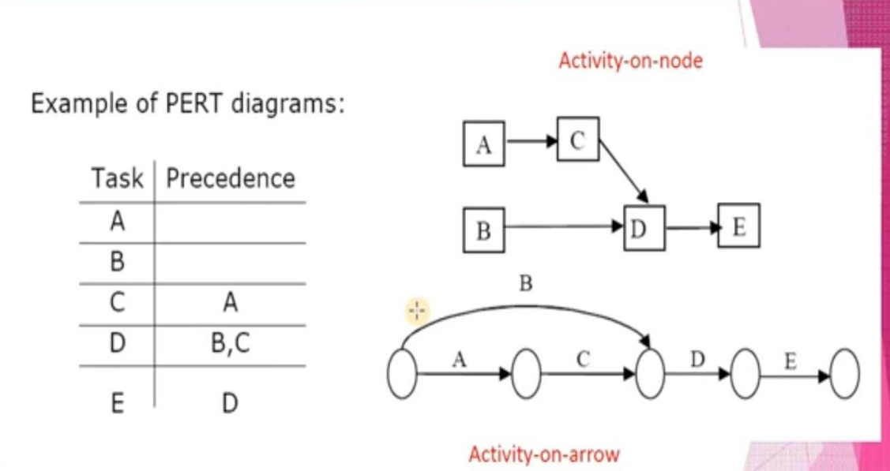

* [Project Initiation](#project-initiation)
* [Organizational Problems](#organizational-problems)
* [Project Selection](#project-selection)
* [Feasibility](#feasibility)
* [Activity Planning](#activity-planning)
* [Estimating Time](#estimating-time)
* [Gantt Charts](#gantt-charts)
* [Advantages of GANTT Chart](#advantages-of-gantt-chart)
* [Disadvantages of GANTT Chart](#disadvantages-of-gantt-chart)
* [GANTT Chart Example](#gantt-chart-example)
* [PERT](#pert)
    * [Activity-on-node diagrams:](#activity-on-node-diagrams)
    * [Activity-on-arrow diagrams:](#activity-on-arrow-diagrams)
* [PERT Diagram Advantages](#pert-diagram-advantages)
* [Pert Diagram Example](#pert-diagram-example)
    * [Question](#question)

## Project Initiation

Projects are initiated for two broad reasons:
- Problems that lend themselves to systems solutions
- Opportunities to improve the organization through 
    - Upgrading existing systems
    - Altering existing systems
    - Installing new systems

## Organizational Problems

Organization can identify problems by 

1. Check output against performance criteria
    - Too many errors
    - Work completed slowly
    - Work done incorrectly
    - Work done incompletely
    - Work not done at all
2. Observe behavior of employees
    - High absenteeism
    - High job dissatisfaction
    - High job turnover
3. Listen to feedback from vendors, customers, and suppliers
    - Complaints
    - Suggestions for improvement
    - Loss of sales
    - Lower sales

## Project Selection
Five specific criteria for project selection
- Backed by management
- Timed appropriately for commitment of resources
- It moves the business toward attainment of its goals
- Practicable
- Important enough to be considered over other projects

## Feasibility
A feasibility study assesses the operational, technical, and economic merits of the proposed project

There are three types of feasibility:
1. Technical feasibility
    - Technical feasibility assesses whether the current technical resources are sufficient for the new system
    - If they are not available, can they be upgraded to provide the level of technology necessary for the new system

2. Economic feasibility
    - Economic feasibility determines whether the time and money are available to develop the system
    - Includes the purchase of
        - New equipment
        - Hardware
        - Software
3. Operational feasibility
    - Operational feasibility determines if the human resources are available to operate the system once it has been installed
    - Users that do not want a new system may prevent it from becoming operationally feasible

## Activity Planning
    
Activity planning includes
- Selecting a systems analysis team
- Estimating time required to complete each task
- Scheduling the project

Two tools for project planning and control are Gantt charts and PERT diagrams

## Estimating Time

- Project is broken down into phases
- Further broken down into tasks or activities
- Finally broken down into steps or even smaller units
- Estimate time for each task or activity
- May use a most likely, pessimistic, and optimistic estimates for time

# Gantt Charts
A type of bar chart that illustrates a project schedule.This project management tool is commonly used to schedule tasks. It is named after its inventor, Henry Gantt (1861-1919), who designed such a chart around the years 1910-1915.It is one of the most popular and useful ways of showing activities (tasks or events) displayed against time.
It is a chart on which -
1. Each task/activity is represented by a bar.
2. The position of each bar reflects the start time and end time of the task/activity.
3. The length of each bar represents the relative length (Duration) of Activ the task/activity.

In a two-dimensional GANTT chart-
1. A suitable time scale is indicated on the horizontal axis/dimension in terms of days or weeks or months or even years.
2. A description of activities/tasks makes up the vertical axis/dimension.

GANTT chart allows the user to visualize the following things at a glance:
1. Various activities/tasks of the project
2. Start time and end time for each activity/task
3. Duration of each activity
4. Overlapping areas between activities and also the amount of overlapping time period
5. Start time, end time and the overall duration of the whole project Go to

## Advantages of GANTT Chart
1. Simple and easy to use.
2. Lends itself to worthwhile and effective communication to the end users especially for the non-technical people.
2. Bars are drawn to scale, that is the size of the bar indicates the relative duration for each task.

## Disadvantages of GANTT Chart
1. Difficult to identify the precedence order.
2. Difficult to identify the critical activities and thus the critical path of the project.
3. Difficult to determine the slack time.

## GANTT Chart Example

## PERT 

Program Evaluation and Review Technique is a network diagram that depicts project activities and their interrelationships
- PERT diagrams show precedence, activities that must be completed before the next activities may be started
- Used to calculate the critical path, the longest path through the activities
- This is the shortest time to complete the project

It is a network model that allows for randomness in activity completion times.This tool used to control the length of projects.PERT was developed in the late 1950's for the US Navy's Polaris Project. First used as a management tool for military projects Adapted as an educational tool for business managers. It has the potential to reduce both the time and cost required to complete a project.

### Activity-on-node diagrams:
- Maybe more than one single start and end node
- Nodes represent activities
- Arrows indicate precedence
### Activity-on-arrow diagrams:
- One single start and one single end node
- Arrows represent activities
- Nodes indicate beginning/end of activities

## PERT Diagram Advantages
- Easy identification of the order of precedence
- Easy identification of the critical path and thus critical activities
- Easy determination of slack time, the leeway to fall behind on noncritical paths

## Pert Diagram Example

### Question 
 Suppose a system analyst 
Symbol  | Activity                      | Predecessor   | Duration
--|--|--|--|
A       | Conduct interviews            | None          |   3
B       | Administer questionnaires     | A             |   4
C       | Read company reports          | None          |   4
D       | Analyze data flow             | B,C           |   8
E       | Introduce prototype           | B,C           |   5
F       | Observe reactions to prototype| E             |   3
G       | Perform cost benefit analysis | D             |   3
H       | Prepare proposal              | F,G           |   2
I       | Present Proposal              | H             |   2

Once the pert diagram is drwan , it is possible to identify the critical path by calculating the sum of the activity times on each path and choosing the longest path. In this example, there are four paths to the goal 

> 10-20-30-50-60-70-80
> 10-20-30-40-60-70-80
> 10-30-40-60-70-80
> 10-30-50-60-70-80

The longest path is

> 10-20-30-50-60-70-80 

which takes 22 days. It is essential that the systems analyst carefully monitors the activities on the crititcal path so as to keep the entire project on time or even shorten the project length if warrented.