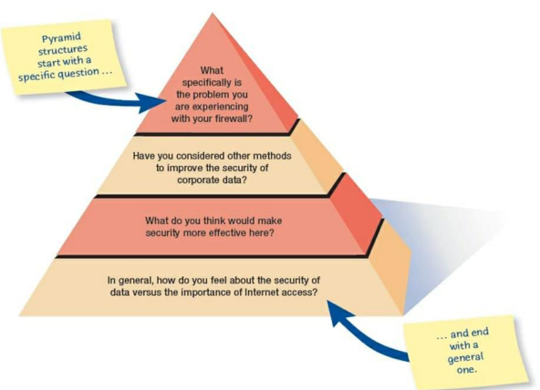
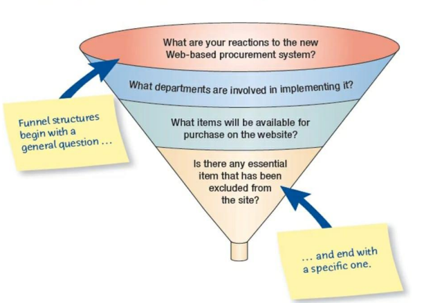
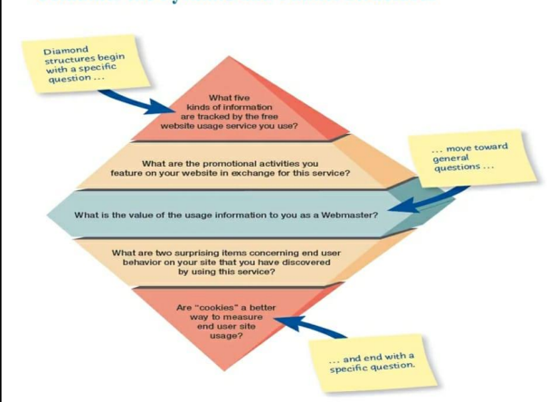
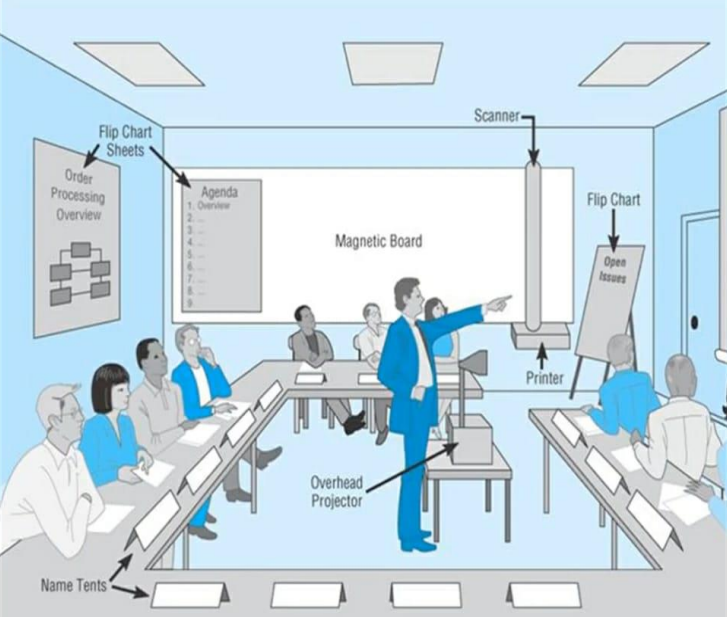

<!-- Create a table of content -->

* [Information Gathering](#information-gathering)
* [Interactive Methods to elicit human info](#interactive-methods-to-elicit-human-info)
* [Interviewing](#interviewing)
* [Interview Preparation](#interview-preparation)
* [Question Types](#question-types)
* [Open-ended questions](#open-ended-questions)
* [Advantages of Open-ended questions](#advantages-of-open-ended-questions)
* [Disadvantages of Open-ended questions](#disadvantages-of-open-ended-questions)
* [Example of Open-ended questions](#example-of-open-ended-questions)
* [Closed Interview Questions](#closed-interview-questions)
* [Advantages of Closed Interview Questions](#advantages-of-closed-interview-questions)
* [Disadvantages of Closed Interview Questions](#disadvantages-of-closed-interview-questions)
* [Attributes of Open-ended and Closed Interview Questions](#attributes-of-open-ended-and-closed-interview-questions)
* [Bipolar Questions](#bipolar-questions)
* [Probes](#probes)
* [Arranging Questions](#arranging-questions)
* [Closing the Interview](#closing-the-interview)
* [Interview Report](#interview-report)
* [Stories](#stories)
* [Listening to Stories](#listening-to-stories)
* [Business Stories](#business-stories)
* [Stories and the Organization](#stories-and-the-organization)
* [Job Application Design (JAD)](#job-application-design-jad)
* [Who is Involved](#who-is-involved)
* [Where to Hold JAD Meetings](#where-to-hold-jad-meetings)
* [Benefits and Drawbacks of JAD](#benefits-and-drawbacks-of-jad)
* [Questionnaires](#questionnaires)
* [Planning for the Use of Questionnaires](#planning-for-the-use-of-questionnaires)
* [Question Types](#question-types-1)
* [Electronically Submitting Questionnaires](#electronically-submitting-questionnaires)

## Information Gathering

1. Interective methods
2. Unobtrusive methods

## Interactive methods to Elicit Human Information Requirements

1. Interviewing
    - Interview Preparation
    - Question Types
    - Arranging Questions
    - The interview report
2. User Stories
3. Joint Application Design (JAD)
    - Involvement
    - Location
4. Questionnaires
    - Writing Questionnaires
    - Using scales
    - Design
    - Administering

## Interviewing
Interviewing is an important method for collecting data on human and system information requirements. It reveals information about
- Interviewee's opinions
- Interviewee's feelings
- Goals
- Key HCI concerns

## Interview Preparation
- Reading background material
- Establishing interview objectives
- Deciding whom to interview
- Preparing the interviewee
- Deciding on question types and structure

## Question Types

1. Open-ended questions
    - Allow interviewee to answer in their own words
    - Useful for getting opinions and feelings
2. Closed questions
    - Allow interviewee to choose from a set of answers
    - Useful for getting factual information

Both are useful for getting information about goals and HCI concerns

## Open-ended questions
1. Interview questions allow interviewee to respond how they wish without length or structure constraints
2. Interview questions are appropriate when the analyst is interested in breadth and depth of reply 

## Advantages of Open-ended questions

1. Makes phrasing easier for the interviewer
2. Puts the interviewee at ease
3. Allows more spontaneity
4. Allows the interviewer to pick up on the interviewee's vocabulary
5. Provides more interest for the interviewee
6. Reveals avenues of further questioning that may have gone untapped
7. Provides richness of detail

## Disadvantages of Open-ended questions

1. May result in too much irrelevant detail
2. Possibly losing control of the interview
3. May take too much time for the amount of useful information gained
4. Possibly giving the impression that the interviewer is on a "fishing expedition"
5. Potentially seeming that the interviewer is unprepared

## Example of Open-ended questions

1. What's your opinion of the current state of business-to-business ecommerce in your firm?
2. What are the critical objectives of your department?
3. Once the data are submitted via the website, how are they processed?
4. Describe the monitoring process that is available online.
5. What are some of the common data entry errors made in this department?
6. What are the biggest frustrations you've experienced during the transition to ecommerce?

## Closed Interview Questions

1. Closed interview questions limit the number of possible responses
2. Closed interview questions are appropriate for generating precise, reliable data that is easy to analyze
3. The methodology is efficient, and it requires little skill for interviewers to administer

## Advantages of Closed Interview Questions

1. Save interview time 
2. Easily compare interviews 
3. Quickly get to the point 
4. Maintain control of the interview 
5. Cover a large area quickly
6. Obtain relevant data

## Disadvantages of Closed Interview Questions
1. May be boring for the interviewee 
2. May fail to obtain rich details May miss some main ideas
3. May fail to build rapport between interviewer and interviewee

## Attributes of Open-ended and Closed Interview Questions

Open-Ended  | Attribute             | Closed
--|--|--
Low         | Reliablity of Data    | High
Low         | Efficient Use of Time | High
Low         | Precision of Data     | High
Much        | Breadth and Depth     | Little
Much        | Interviewer Skill     | Little
Difficult   | Ease of Analysis      | Easy

## Bipolar Questions
Question those can be answered with a "Yes" or "No" are called bipolar questions. It should be used sparingly. It is special kind of closed question.

## Probes 
Probing questions provoke more detail about previous question.
The purpose of probing is 
- To get more meaning
- To calrify
- To draw out and expand on the interviewee's ideas

It may be used in both open-ended and closed questions.

## Arranging Questions

1. Pyramid
    - Starting with closed questions and working toward open- ended questions
        - Begins with very detailed, often closed questions
        - Expands by allowing open-ended questions and more generalized responses
        - Is useful if interviewees need to be warmed up to the topic or seem reluctant to address the topic

2. Funnel
    - Starting with open-ended questions and working toward closed questions
        - Begins with generalized, open-ended questions
        - Concludes by narrowing the possible responses using closed questions
        - Provides an easy, nonthreatening way to begin an interview
        - Is useful when the interviewee feels emotionally about the topic

3. Diamond
    - Starting with closed, moving toward open-ended, and ending with closed questions
        - A diamond-shaped structure begins in a very specific way
        - Then more general issues are examined
        - Concludes with specific questions
        - Combines the strength of both the pyramid and funnel structures
        - Takes longer than the other structures

## Closing the Interview
1. Always ask "Is there anything else that you would like to add?"
2. Summarize and provide feedback on your impressions
3. Ask whom you should talk with next
4. Set up any future appointments
5. Thank them for their time and shake hands.

## Interview Report
1. Review the report with the respondent
2. Provide an initialsummary, then moredetail
3. Write as soon as possible after the interview

## Stories
1. Stories originate in the workplace
2. Organizational stories are used to relay some kind of information
3. When a story is told and retold over time it takes on a mythic quality
4. Isolated stories are good when you are looking for facts
5. Enduring stories capture all aspects of the organization and are the ones a systems analyst should look be seeking

## Listening to Stories
- Listening to stories is not efficient
- It takes considerably more time than asking interview questions
- Listening to stories may be more rewarding
- Stories are more easily remembered than interview responses

## Business Stories
Business stories can be broken down into four important main types:
1. Experiential stories
2. Prescriptive stories
3. Validating stories
4. Explanatory stories

## Stories and the Organization
1. Engage organization participants by reacting to stories
2. Match one story to another by recounting it to other participants, and collaborating with the stories
3. It is a way to deeply understand some of the problems associated with information systems

## Job Application Design (JAD)

JAD is a technique that allows the analyst to accomplish requirements analysis and design the user interface with the users in a group setting. It can replace a series of interviews with the user community.

## Who is Involved
- Scribe
- Observers
- Executive sponsor
- Session leader
- IS analyst
- Users

## Where to Hold JAD Meetings
### Offsite
- Comfortable surroundings
- Minimize distractions
### Attendance

- Schedule when participants can attend Agenda
- Orientation meeting

## Benefits and Drawbacks of JAD
### Benefits of JAD
- Time is saved, compared with traditional interviewing
- Rapid development of systems
- Improved user ownership of the system 
- Creative idea production is improved
### Drawbacks of Using JAD
- JAD requires a large block of time to be available for all session participants
- If preparation or the follow-up report is incomplete, the session may not be successful
- The organizational skills and culture may not be conducive to a JAD session

## Questionnaires
Questionnaires are useful in gathering information from key organization members about
- Attitudes
- Beliefs
- Behaviors 
- Characteristics

## Planning for the Use of Questionnaires
1. Organization members are widely dispersed
2. Many members are involved with the project
3. Exploratory work is needed
4. Problem solving prior to interviews is necessary

## Question Types
Questions are designed as either:
- Open
     - Try to anticipate the response you will get ended 
     - Well suited for getting opinions
- Closed
    - Use when all the options may be listed 
    - When the options are mutually exclusive

## Electronically Submitting Questionnaires
- Reduced costs
- Collecting and storing the results electronically