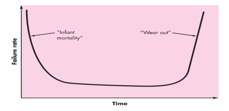
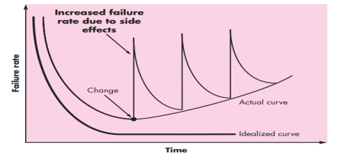
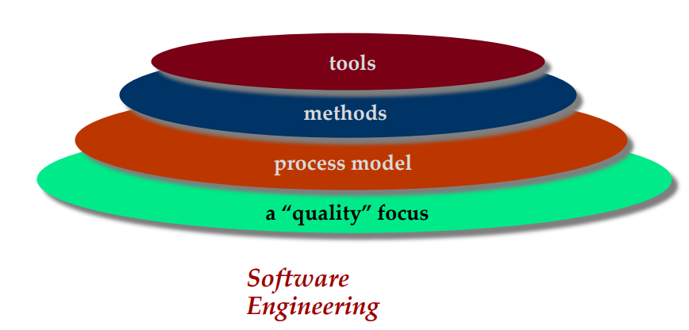

# Book followed

**Software Engineering: A Practitioner’s Approach
by Roger S. Pressman and Bruce R. Maxim**

# 1. Introudction

## What is software? 

Software is

1. **Instructions** (computer programs ) that when executed provide desired features and functions and performance
2. **Data structures** that enable programs to adequately manipulate information
3. **Documentation** that describe the operation and use of the program

Software is developed or engineered. it is not manufactured in the classical sense. Software does not wear out, but it does deteriorate. Although the industry is moving toward component-based construction, most software continues to be custom built.

## Wear vs Deterioration

 

## Software Applications

1. System software
2. Application software
3. Engineering and scientific software
4. Embedded software
5. Product-line software
6. Web-applications
7. Artificial intelligence software

## Software new categories

1. Open world computing - pervasive , distributed computing
2. Ubiquitous computing - wireless networks
3. Netsourcing - the web as a computer engine
4. Open source - Free source code open to the the comminuty

## Why open source is curse ?

1. No one is responsible for the code
2. No one is responsible for the documentation
3. No one is responsible for the testing
4. No one is responsible for the maintenance

## Why legacy software must changes?

1. To be adopted to meet the need of new computing environment or technology
2. To be enhanced to implement new business requirements
3. To be extended to make it interoperable with other systems
4. To be re-arhitectured to make it viable within a network environment

## Charecteristics of WebApps

- **Network intesive** A web app resides on a network and must serve the need of a diverse community of clients

- **Concurrency** A large number of users may access the web app at the same time

- **Unpredictable load** The number of users of the webApp maybe vary by orders of magnitude from day to day

- **Performance** If a webapp user must wait too long he or she may decide to go elsewhere

- **Availability** Although expectation of 100% availability are unrealistic, a webapp must be available most of the time on access of 24/7/365 basis.

- **Data driven** The primary function of many WebApps is to use **hypermedia** to present text, graphics, audio, and video content to the end-user.

- **Content sensitive** The quality and aesthetic nature of content remains an important determinant of the quality of a WebApp.

- **Continuous evolution** Unlike conventional application software that evolves over a series of planned, chronologically-spaced releases, Web applications evolve continuously.

- **Immediacy** Although immediacy—the compelling need to get software to market quickly—is a characteristic of many application domains, WebApps often exhibit a time to market that can be a matter of a few days or weeks.

- **Security** Because WebApps are available via network access, it is difficult, if not impossible, to limit the population of end-users who may access the application.

- **Aesthetics** An undeniable part of the appeal of a WebApp is its 
look and feel.

## What is software engineering?

A concerted effort should be made to understand the problem before a software solution is developed where design becomes a pivotal activity. The software should exhibit high quality and should be maintainable and dependable.

 The seminal definition

> Software enginnering is the establishment and use of **sound engineering principles** in order to obtain **economically software** that is **reliable** and **works efficiently** on real machines. 

IEEE Defination

> Software engineering is the application of a systematic, disciplined, quantifiable approach to the development, operation, and maintenance of software; that is, the application of engineering to software.

## Software engineering is a layerd technology

## A process framework

### Framework activities

Framework activities are activities that are applicable to all software projects, regardless of their size or complexity.

- Communication
- Planning
- Modeling
    - Analysis of requirements
    - Design
- Construction
    - Code generation
    - Testing
- Deployment

### Umbrella activities

Umberlla activities are activities that are applied throughout the software process.

- Software project management
- Formal technical reviews
- Software quality assurance
- Software configuration management
- Work product preparation and production
- Reusability management
- Measurement
- Risk management

## Adapting a process model
■ the flow of **activities, actions, and tasks and the interdependencies** among them

■ the degree to which **actions and tasks** are defined within each framework activity

■ the degree to which work **products are identified** and required

■ the manner which **quality assurance** activities are applied

■ the manner in which project **tracking and control** activities are applied

■ the overall degree of **detail and rigor** with which the process is described

■ the degree to which the **customer and other stakeholders** are involved with the project

■ the **level of autonomy** given to the software team

■ the degree to which **team organization** and roles are prescribed

## The Essence of Practice by Polya

1. Understand the problem (communication and analysis).
    - Who has a stake in the solution to the problem?
        - That is, who are the stakeholders?

    - What are the unknowns? 
        - What data, functions, and features are required to properly solve the problem?
    - Can the problem be compartmentalized? 
        - Is it possible to represent smaller problems that may be easier to understand?
    - Can the problem be represented graphically?
        - Can an analysis model be created?
2. Plan a solution (modeling and software design).
    - Have you seen similar problems before?
        - Are there patterns that are recognizable in a potential solution? Is there existing software that implements the data, functions, and features that are required? 
    - Has a similar problem been solved? 
        - If so, are elements of the solution reusable?
    - Can subproblems be defined? 
        - If so, are solutions readily apparent for the subproblems?
    - Can you represent a solution in a manner that leads to effective implementation?      
        - Can a design model be created?
3. Carry out the plan (code generation).
    - Does the solution conform to the plan?
        - Is source code traceable to the design model?
    - Is each component part of the solution provably correct?
        - Has the design and code been reviewed, or better, have correctness proofs been applied to algorithm?

4. Examine the result for accuracy (testing and quality assurance).
    - Is it possible to test each component part of the solution?
        - Has a reasonable testing strategy been  implemented?
    - Does the solution produce results that conform to the data, functions, and features that are required?
        - Has the software been validated against all stakeholder requirements?

## Hooker’s General Principles

1. The Reason It All Exists
2. KISS (Keep It Simple, Stupid!)
3. Maintain the Vision
4. What You Produce, Others Will Consume
5. Be Open to the Future 
6. Plan Ahead for Reuse
7. Think!

## Software Myths
1. Affect managers, customers (and other non-technical stakeholders) and practitioners
2. Are believable because they often have elements of truth, 

but …
- Invariably lead to bad decisions,

therefore …

- Insist on reality as you navigate your 
way through software engineering

## How it all starts
SafeHome:

Every software project is precipitated by some business need to—
- **correct a defect** in an existing application
- the need to **adapt a ‘legacy system’** to a changing business environment
- **extend the functions** and features of an existing application, or
- create a **new product, service, or system**.

