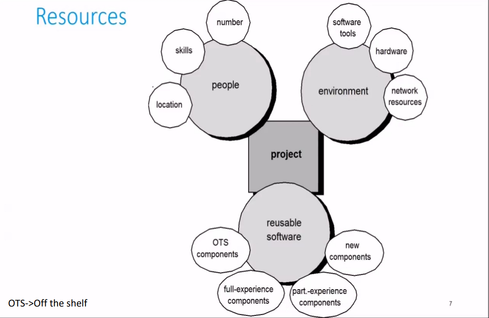
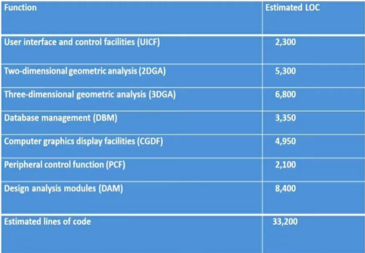
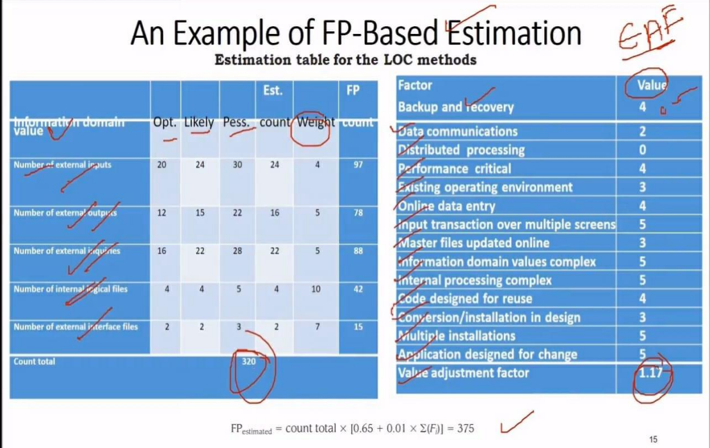

# Estimation for software projects

## Software Project planning
 The overall goal of planning is to establish a pragmatic strategy for controlling , tracking and monitoring a complex technical project. Planning is an essential step in estimating the time required to complete a project. The planning process should result in a set of actions to define and coordinate the following

 ### Why do we need to estimate?
 So the end result gets done on time , with quality

 ## Project planning Task Set 

 ```mermaid 
 
graph LR

A[Project planning] --> B[Establish Project scope]
A --> C[Determine Feasibility]
A --> D[Analyze Risks]
A --> E[Define Resources]
A --> F[Estimate Cost and Effort]
A --> G[Develop Project Schedule]
 ```

- Establish the project scope
- Determine the feasibility of the project
- Analyze the risks
    - Risk analysis is considered in details
- Define required resources
    - Determine the human resources
    - Determine reusable software resources
    - Determine other resources
- Estimate cost and effort
    - Decompose the problem
    - Develop two or more estimates using size , function points , process tasks or uses cases
    - Reconcile the estimates
- Develop a project schedule
    - Establish a meaningful task set
    - Define a task network
    - Use scheduling tools to develop a timeline chart
    - Define schedule tracking mechanism

## What is Scope?

- The functions and features that are to be delivered to end users
- The data that are input and output by the system
- The "Content" that is presented to t users as consequence of using the software
- The performance , constraints , interface and reliability that bound the system

## How to define scope?

- A narrative description of the project scope is developed after communication with all stakeholders
- A set of use-case is developed by end-users

## What is resource?


## What is estimation?

> Good estimating approaches and solid historical data offer the best hope that reality will win out over impossible demands

Estimation of resource cost and schedule for a software engineering effort requires 

- Experience
- Access to good historical data
- The courage to commit to quantitative predictions when qualitative information is all that is available

Esimation carries inherent risk and this risk leads to uncertainty. The project complexity project size and the degree of structural uncertainty all effect the reliability of estimates.

## Software Project Estimation

To achieve reliable cost and effor estimates a number of option arises

- Delay estimation until late in the project life cycle
- Base estimates on simmilar projects that have been completed in the past
- Use relatively simple decomposition techniques to generate project estimates
- Use one or more empirical models for software cost and effort estimation

## Estimation Techniques

- Past project experience
- Conventional estimation
    - Task breakdown and effort estimation
    - Size estimation
- Empirical estimation
- Automated estimation

## Decomposition Techniques Software Siziing

The accuracy of a software project estimate is predicted on a number of things
- The degree to which planner has properly estimated the size of the product to be built
- The ability to translate the size estimate into human effort , calander time  and doller
- The degree to which the project plan reflects the abilities of the software team
- The stability of product requirements and the environment that supports the software engineering effort

## Problem based Estimation

- Lines of code and function points were described as measures from which productivity metrics can be computed. LOC and FP data are used in two ways during estimation
    - as estimation variables to size each element of the software
    - As baseline metric collected from past projects and used in conjunction with estimation variables to develop cost and effort projections

A three point or expected value can be computed . The expected value for the estimation variable size (S) can be computed as weighted average of the optimistic (Sopt) most likely (Sml) and pessimistic (Spes) estimates. For example

> S = (Sopt + 4Sml + Spes)/6

## Conventional approach (LOC/FP)
- Compute LOC/FP using estimates of information domain values
- Use historical data to build estimates for the project

## Example of LOC based estimation



## Example of FP based estimation


