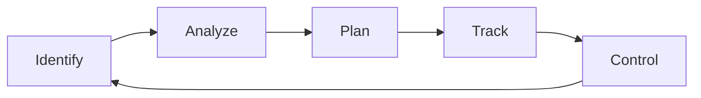

# Risk Analysis

## Project Risk
- What can go wrong?
- What is the likelihood ?
- What will the damage be?
- What can we do about it?

## Reactive risk management

project team reacts to risks when they occur
1. mitigation—plan for additional resources in anticipation of fire fighting
2. fix on failure—resource are found and applied when the risk strikes
3. crisis management—failure does not respond to applied resources and project is in jeopardy

## Proactive Risk Management

Formal risk analysis is performed and organization corrects the root causes of the risk
1. TQM concepts and statistical SQA
2. examining risk sources that lie beyond the bounds of the software
3. developing the skill to manage change

## Seven Principles

- **Maintain a global perspective** — view software risks within the context of system and the business problem 
- **Take a forward-looking view** — think about the risks that may arise in 
the future; establish contingency plans 
- **Encourage open communication** —if someone states a potential risk, donʼt discount it. 
- **Integrate** —a consideration of risk must be integrated into the software 
process
- **Emphasize a continuous process**—the team must be vigilant throughout the software process, modifying identified risks as more information is known and adding new ones as better insight is achieved.
- **Develop a shared product vision**—if all stakeholders share the same 
vision of the software, it likely that better risk identification and 
assessment will occur.
- **Encourage teamwork**—the talents, skills and knowledge of all 
stakeholder should be pooled

## Risk Management Paradigm

## Risk Identification

- **Product size**—risks associated with the overall size of the software to be 
built or modified.
- **Business impact**—risks associated with constraints imposed by management or the marketplace.
- **Customer characteristics**—risks associated with the sophistication of the 
customer and the developer's ability to communicate with the customer in a timely manner.
- **Process definition**—risks associated with the degree to which the software process has been defined and is followed by the development organization.
- **Development environment**—risks associated with the availability and quality of the tools to be used to build the product.
- **Technology to be built**—risks associated with the complexity of the system to be built and the "newness" of the technology that is packaged by the system.
- **Staff size and experience**—risks associated with the overall technical and project experience of the software engineers who will do the work.

## Assessing Project Risk
- Have top software and customer managers formally committed to support the project?
- Are end-users enthusiastically committed to the project and the system/product to be built?
- Are requirements fully understood by the software engineering team and their customers?
- Have customers been involved fully in the definition of requirements?
- Do end-users have realistic expectations?
- Is project scope stable?
- Does the software engineering team have the right mix of skills?
- Are project requirements stable?
- Does the project team have experience with the technology to be implemented?
- Is the number of people on the project team adequate to do the job?
- Do all customer/user constituencies agree on the importance of the project and on the requirements for the system/product to be built?

## Risk Components
- **performance risk**—the degree of uncertainty that the product will meet its requirements and be fit for its intended use.
- **cost risk**—the degree of uncertainty that the project budget will be maintained.
- **support risk**—the degree of uncertainty that the resultant software will be easy to correct, adapt, and enhance.
- **schedule risk**—the degree of uncertainty that the project schedule will be maintained and that the product will be delivered on time.

## Risk Projection
Risk projection, also called risk estimation,attempts to rate each risk in two ways
- the likelihood or probability that the risk is real 
- the consequences of the problems associated with the risk, should it occur.

The are four risk projection steps
- establish a scale that reflects the perceived likelihood of a risk
- delineate the consequences of the risk
- estimate the impact of the risk on the project and the product,
- note the overall accuracy of the risk projection so that there will be no misunderstandings.

## Building a Risk Table
The table should sorted by probability and impact
Risk | Probability | Impact | RMMM
--- | --- | --- | ---
| | Estimate the probability of occurrence|  Estimate the impact on the project on a scale of 1 to 5, where    1 = low impact on project success   5 = catastrophic impact on project success| Risk Mitigation, Monitoring, Management

## Risk Exposure
The overall risk exposure, RE, is determined using the following relationship [Hal98]:

> RE = P x C

P is the probability of occurrence 
C is the cost impact if the risk becomes a reality.

### Example

- **Risk identification** Only 70 percent of the software 
components scheduled for reuse will, in fact, be integrated into 
the application. The remaining functionality will have to be 
custom developed.
- **Risk probability** 80% (likely).
- **Risk impact** 60 reusable software components were planned. If only 70 percent can be used, 18 components would have to be developed from scratch (in addition to other custom software that has been scheduled for development). Since the average component is 100 LOC and local data indicate that the software engineering cost for each LOC is $14.00, 
the overall cost (impact) to develop the components would be 
> 18 x 100 x 14 = $25,200.

> Risk exposure. RE = 0.80 x 25,200 ~ $20,200.

## Risk Mitigation, Monitoring,and Management
- **Mitigation** - how can we avoid the risk?
- **Monitoring** — what factors can we track that will enable us to determine if the risk is becoming more or less likely?
- **Management** — what contingency plans do we have if the risk becomes a reality?

## Risk Due to Product Size

- Estimated size of the product in LOC or FP
- Estimated size of product in number of program , files , transactions?
- Percentage of deviation in size of product from average previous products?
- Size of databse created or used by the product
- Number of users of the product
- Number of projected changes to the requirements for the product? Before delivery? After delivery?
- Amount of reused software?

## Risk Due to Business Impact
- Affect of this product on company revenue?
- Visibility of this product by senior management?
- Resonableness of delivery deadline?
- Number of customer who will use the product?
- Interoperability constraints
- Sophistication of end users
- Amound and quality of product documentation that must be produced and delivered to the customer
- Governmental constraints
- Costs associated with late delivery
- Costs associated with defective software

## Risks Due to the Customer

- Have you worked with the customer in the past?
- Does the customer have a solid idea of requirements?
- Has the customer agreed to spend time with you? 
- Is the customer willing to participate in reviews?
- Is the customer technically sophisticated?
- Is the customer willing to let your people do their job-that is, will the customer resist looking over your shoulder during technically detailed work?
- Does the customer understand the software engineering process?

## Risks Due to Process Maturity

- Have you established a common process framework?
- Is it followed by project teams?
- Do you have management support for software engineering
- Do you have a proactive approach to SQA?
- Do you conduct formal technical reviews?
- Are CASE tools used for analysis, design and testing?
- Are the tools integrated with one another?
- Have document formats been established?

## Technology Risks

- Is the technology new to your organization? 
- Are new algorithms, I/O technology required?
- Is new or unproven hardware involved?
- Does the application interface with new software?
- Is a specialized user interface required?
- Is the application radically different?
- Are you using new software engineering methods?
- Are you using unconventional software development methods, such as formal methods, Al-based approaches, artificial neural networks?
- Are there significant performance constraints?
- Is there doubt the functionality requested is "do-able?"

## Staff/People Risks
- Are the best people available?
- Does staff have the right skills?
- Are enough people available?
- Are staff committed for entire duration?
- Will some people work part time?
- Do staff have the right expectations?
- Have staff received necessary training?
- Will turnover among staff be low?

## Record Risks

<!-- Make a table using the informations above -->

Project |Risk Type | Priority | Risk factor | Probability | Impact | Monitoring approach | Contingency plan | Estimated resources
--- | --| --- | --- | --- | --- | --- | --- | ---
Embedded software for XYZ system| Schedule Risk | 4 | Project completion will depend on tests which require hardware component under development. Hardware componentdelivery may be delayed | 60% | Project completion will be delayed for each day that hardware is unavailable for use in software testing | Scheduled milestone reviews with hardware group | Modification of testing strategy to accommodate delay using software simulation | 6 additional person months beginning in July