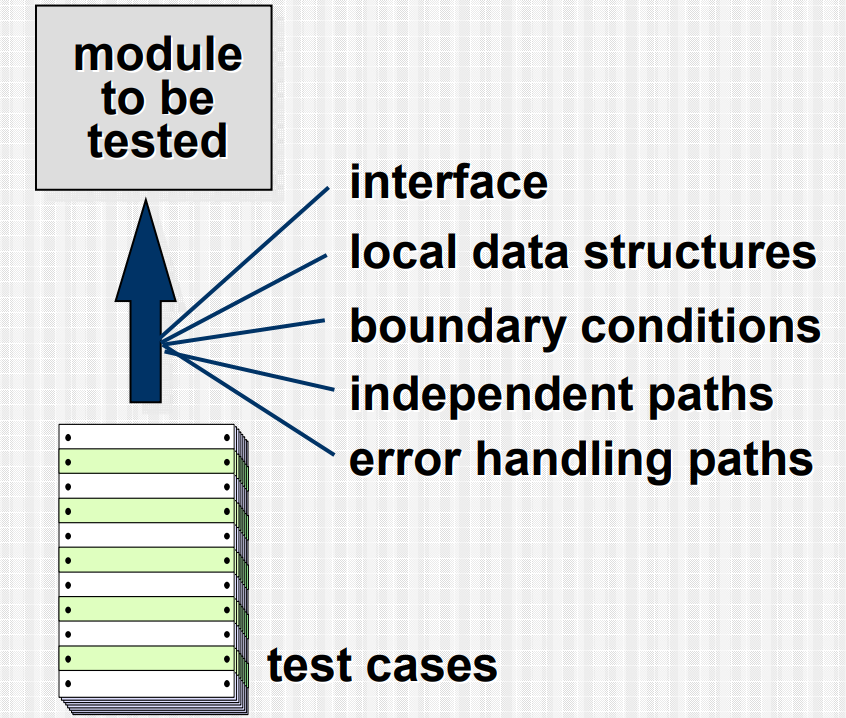

# Software testing 
Testing is the process of exercising a program with the specific intent of finding errors prior to delivery to the end user.

<!-- Make a table of content of the whole file -->

Table of content
================

<!--ts-->

   * [Software testing](#software-testing)
      * [What is testing?](#what-is-testing)
      * [Why is testing necessary?](#why-is-testing-necessary)
      * [What testing shows?](#what-testing-shows)
      * [Strategic approach to software testing](#strategic-approach-to-software-testing)
      * [V and V](#v-and-v)
         * [Verification](#verification)
         * [Validation](#validation)
      * [Who tests the software?](#who-tests-the-software)
      * [Testing Strategies](#testing-strategies)
         * [For conventional software](#for-conventional-software)
         * [For OO software](#for-oo-software)
      * [Strategic Issues](#strategic-issues)
      * [Unit testing](#unit-testing)
      * [Unit testing environment](#unit-testing-environment)
      * [Integration testing](#integration-testing)
      * [Top-down integration testing](#top-down-integration-testing)
      * [Bottom-up integration testing](#bottom-up-integration-testing)
      * [Sandwich integration testing](#sandwich-integration-testing)
      * [Regression testing](#regression-testing)
      * [Smoke testing](#smoke-testing)
      * [Object-oriented testing](#object-oriented-testing)
      * [Broadening the View of “Testing”](#broadening-the-view-of-testing)
      * [OO Testing Strategy](#oo-testing-strategy)
      * [WebApp Testing](#webapp-testing)
      * [High-Order Testing](#high-order-testing)
      * [Consequence of Bugs](#consequence-of-bugs)
      * [Debugging : A Diagnostic Process](#debugging--a-diagnostic-process)
      * [Debugging Effort](#debugging-effort)
      * [Symptoms and Causes](#symptoms-and-causes)
      * [Debugging Strategies](#debugging-strategies)
      * [Correcting the Error](#correcting-the-error)
      * [Final Thoughts](#final-thoughts)

## What testing shows? 

## Strategic approach to software testing
- To perform effective testing, you should conduct effective technical reviews. By doing this, many errors will be eliminated before testing commences.
- Testing begins at the component level and works "outward" toward the integration of the entire computer-based system. 
- Different testing techniques are appropriate for different software engineering approaches and at different points in time.
- Testing is conducted by the developer of the software and (for large projects) an independent test group.
- Testing and debugging are different activities, butdebugging must be accommodated in any testing strategy.

## V and V

### Verification 
refers to the set of tasks that ensure that software correctly implements a specific 
function. 
### Validation 
refers to a different set of tasks that ensure that the software that has been built is traceable to customer requirements. 
Boehm [Boe81] states this another way: 
> Verification: "Are we building the product right?" 

> Validation: "Are we building the right product?"

## Who tests the software?

## Testing Strategies
We begin by ‘testing-in-the-small’ and move toward ‘testing-in-the-large’

### For conventional software
- The module (component) is our initial focus
- Integration of modules follows
#### For OO software
- our focus when “testing in the small” changes from an individual module (the conventional view) to an OO class that encompasses attributes and operations and implies communication and collaboration

## Strategic Issues
- Specify product requirements in a quantifiable manner long before testing commences. 
- State testing objectives explicitly. 
- Understand the users of the software and develop a profile for each user category.
- Develop a testing plan that emphasizes “rapid cycle testing.”
- Build “robust” software that is designed to test itself
- Use effective technical reviews as a filter prior to testing
- Conduct technical reviews to assess the test strategy and test cases themselves. 
- Develop a continuous improvement approach for the testing process.

## Unit testing

## Unit testing environment

## Integration testing
Options 
- The “big bang” approach
- The “incremental” approach

## Top-down integration testing

## Bottom-up integration testing

## Sandwich integration testing

## Regression testing

- **Regression testing** is the re-execution of some subset of tests that have already been conducted to ensure that changes have not propagated unintended side effects
- Whenever software is corrected, some aspect of the software configuration (the program, its documentation, or the data that support it) is changed. 
- Regression testing helps to ensure that changes (due to testing or for other reasons) do not introduce unintended behavior or additional errors.
- Regression testing may be conducted manually, by re-executing a subset of all test cases or using automated capture/playback tools

## Smoke testing
A common approach for creating “daily builds” for product software

Steps : 
- Software components that have been translated into code are 
integrated into a “build.”
    - A build includes all data files, libraries, reusable modules, and engineered 
components that are required to implement one or more product functions.
- A series of tests is designed to expose errors that will keep the build from properly performing its function. 
    - The intent should be to uncover “show stopper” errors that have the highest likelihood of throwing the software project behind schedule.
- The build is integrated with other builds and the entire product (in its current form) is smoke tested daily. 
    - The integration approach may be top down or bottom up.

## Object-oriented testing
Begins by evaluating the correctness and consistency of the analysis and design models.Test case design draws on conventional methods, but also encompasses special features

testing strategy changes
- the concept of the ‘unit’ broadens due to encapsulation
- integration focuses on classes and their execution across a ‘thread’ or in the context of a usage scenario
- validation uses conventional black box methods

## Broadening the View of “Testing”

It can be argued that the review of OO analysis and design models is especially useful because the  same semantic constructs (e.g., classes, attributes,  operations, messages) appear at the analysis,  design, and code level. Therefore, a problem in the definition of class attributes that is uncovered  during analysis will circumvent side effects that  might occur if the problem were not discovered  until design or code (or even the next iteration of analysis). 

## OO Testing Strategy

- class testing is the equivalent of unit testing
    - operations within the class are tested
    - the state behavior of the class is examined
- integration applied three different strategies
    - **thread-based testing**—integrates the set of classes required to respond to one input or event
    - **use-based testing**—integrates the set of classes required to respond to one use case
    - **cluster testing**—integrates the set of classes required to demonstrate one collaboration

## WebApp Testing
- The content model for the WebApp is reviewed to uncover errors. 
- The interface model is reviewed to ensure that all use cases can be accommodated. 
- The design model for the WebApp is reviewed to uncover navigation errors. 
- The user interface is tested to uncover errors in presentation and/or navigation mechanics.
- Each functional component is unit tested.
- Navigation throughout the architecture is tested. 
- The WebApp is implemented in a variety of differentenvironmental configurations and is tested for compatibility with each configuration. 
- Security tests are conducted in an attempt to exploit vulnerabilities in the WebApp or within its environment.
- Performance tests are conducted.
- The WebApp is tested by a controlled and monitored population of end-users. The results of their interaction with the system are evaluated for content and navigation errors, usability concerns, compatibility concerns, and WebApp reliability and performance.

## High-Order Testing

Test Name | Defination 
--- | ---
Validation testing | Focus is on software requirements
System testing | Focus is on system integration
Alpha/Beta testing | Focus is on customer usage
Recovery testing | forces the software to fail in a variety of ways and verifies that recovery is properly performed
Security testing | verifies that protection mechanisms built into a system will, in fact, protect it from improper penetration
Stress testing | executes a system in a manner that demands resources in abnormal quantity, frequency, or volume
Performance Testing | test the run-time performance of software within the context of an integrated system

## Consequence of Bugs

Bug categories
1. Functionality bugs
2. System bugs
3. Data bugs
4. Coding bugs
5. Design bugs
6. Documentation bugs
7. Standards violations

## Debugging : A Diagnostic Process

## Debugging Effort

## Symptoms and Causes

1. symptom and cause may be geographically separated 
2. symptom may disappear when another problem is fixed
3. symptom may be intermittent
4. cause may be due to a combination of non-errors 
5. cause may be due to a system or compiler error
6. cause may be due to assumptions that everyone believes 

## Debugging Strategies
1. brute force / testing
2. backtracking
3. induction
4. deduction

## Correcting the Error
- Is the cause of the bug reproduced in another part of the 
program? 

    - In many situations, a program defect is caused by an erroneous pattern of logic that may be reproduced elsewhere. 
- What "next bug" might be introduced by the fix I'm about to 
make?
    - Before the correction is made, the source code (or, better, the design) should be evaluated to assess coupling of logic and data structures. 

-  What could we have done to prevent this bug in the first place?
    - This question is the first step toward establishing a statistical software quality assurance approach. If you correct the process as well as the product, the bug will be removed from the current program and may be eliminated from all future programs.

## Final Thoughts

- Think -- before you act to correct
- Use tools to gain additional insight
- If you’re at an impasse, get help from someone else
- Once you correct the bug, use regression testing to uncover any side effects