# Process Models

## Persepective Models

- Prescriptive process models advocate an orderly approach to software engineering

That leads to a few questions …
- If prescriptive process models strive for structure and order, are they inappropriate for a software world that thrives on change? 
- Yet, if we reject traditional process models (and the order they imply) and replace them with something less structured, do we make it impossible to achieve coordination and coherence in software work?

## The Waterfall Model

### Advantages
- Requirements are very well documented, clear and fixed.

- Technology is understood and is not dynamic.

- There are no ambiguous requirements.

- The project is short

### Disadvantages
- it does not allow for much reflection or revision

- Once an application is in the testing stage, it is very difficult to go back and change something that was not well-thought out in the concept stage.

- No working software is produced until late during the life cycle.

- High amounts of risk and uncertainty.

- Poor model for complex and object-oriented projects.

- Poor model for long and ongoing projects.

- Poor model where requirements are at a moderate to high risk of changing.

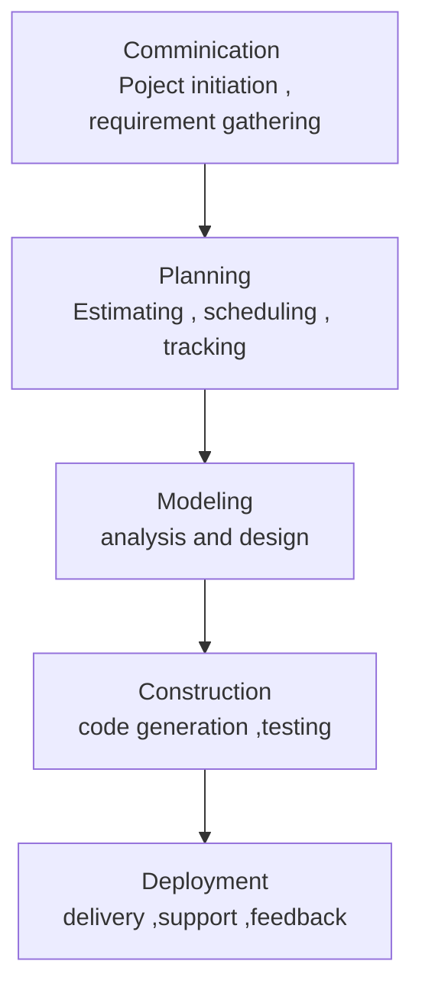

## The V-Model

### Advantages
- Simple and easy to use.

- Testing activities like planning, test designing happens well before coding. This saves a lot of time.

- Works well for small projects where requirements are easily understood.

- Clearly defined testing methods and deliverables.

- Works well when testers are involved in the project from the beginning.

### Disadvantages

- Very rigid, like the waterfall model.

- Little flexibility and adjusting scope is difficult and expensive.

- Software is developed during the implementation phase, so no early prototypes of the software are produced.

- Model doesn’t provide a clear path for problems found during testing phases.

- High amounts of risk and uncertainty.

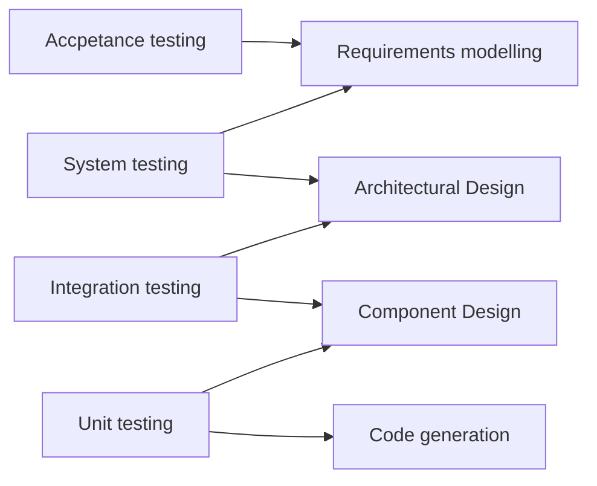

## The Incremental Model

Increments over the time of the project following the waterfall model

### Advantages

- Generates working software quickly and early during the software life cycle.

- More flexible – less costly to change scope and requirements.

- Easier to test and debug during a smaller iteration.

- Easier to manage risk because risky pieces are identified and handled during its iteration.

- Each iteration is an easily managed milestone.

### Disadvantages

- Each phase of an iteration is rigid and do not overlap each other.

- Problems may arise pertaining to system architecture because not all requirements are gathered up front for the entire software life cycle.

- The model applies to small and medium sized projects only.

- It is tough to measure progress within stages.

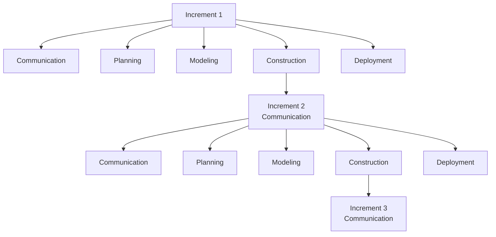

## The Evolutionary Model

### Advantages

- User can see the system early in the process.

- Developer can get early feedback from the user.

- More rapid delivery of useful software is possible.

- Early releases help to win contracts.

- Customers are able to use and gain value from the system earlier than with a conventional approach.

- Early releases act as a risk reduction mechanism for both customer and developer.

- It is easier to get customer feedback on the development work that has been done.

- Customers can comment on demonstrations of the software and see how much has been implemented.

- Developers can experiment with different approaches to a problem.

- Developers can identify parts of the system that will cause problems and can develop alternative strategies for dealing with them.

- Developers and customers can assess the technical risks associated with a project.

- Developers and customers can assess the business risks associated with a project.

- Developers can use the evolutionary delivery as a prototype for a product that is to be developed and sold.

- Developers can learn about the application domain as the system is developed.

- Developers can identify parts of the system that will cause problems and can develop alternative strategies for dealing with them.

### Disadvantages

- The process is not visible.

- Systems are often poorly structured.

- Special skills (e.g. in languages for rapid prototyping) may be required.

- The model is not suitable for large-scale systems.

- Capturing the requirements for the system can be difficult.

- The model usually relies on the skills and commitment of individual developers rather than following an engineering process.

- The model is not appropriate for other types of software (e.g. real-time systems) where system specification is essential before development commences.

- The model has a high risk of delivering an unsatisfactory system because of the difficulties of user requirements elicitation.

- The model requires a mechanism for customer evaluation of the prototype versions of the system.

- The model requires a mechanism for developers to incorporate user feedback into the system specification.

### Prototyping

- Prototyping is the process of building a model of a system. In terms of an information system, prototypes are employed to help system designers build an information system that intuitive and easy to manipulate for end users.

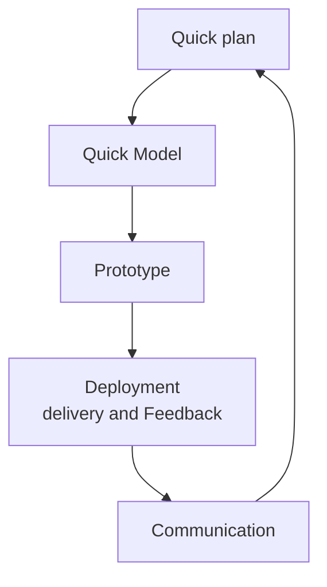

### The Spiral 

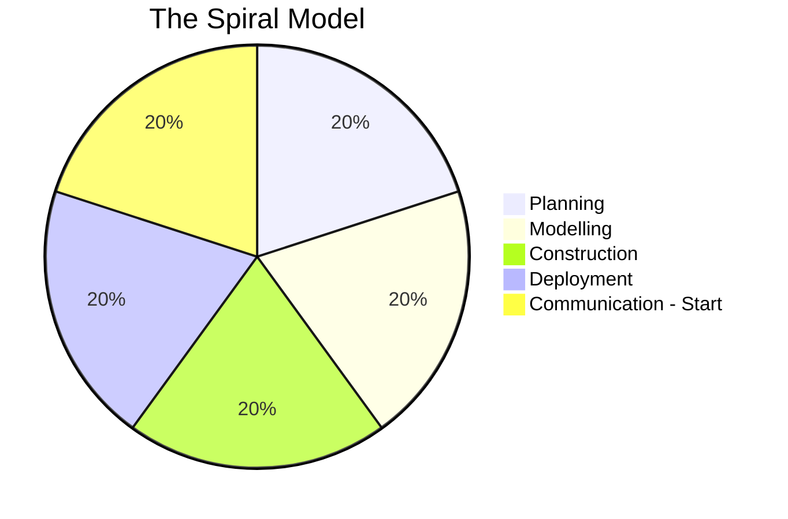

### Concurrent

1. In real life the software development activities do not take place in sequence
2. Most activities will be going on concurrently but reside in different states. 
3. The states will change when some event occurs 
4. All the activities are shown along with their states at any point of time.
5. As time goes on the states of the activities will change.

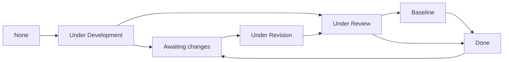

## The unified process

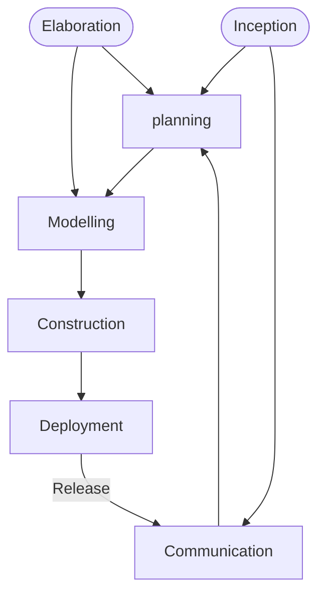

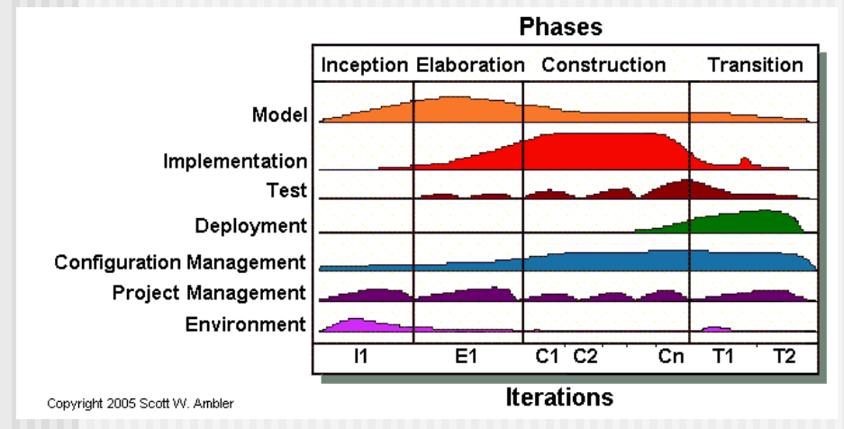

# Agile Development

## What is Agility?

1. Effective (rapid and adaptive) response to change
2. Effective communication among all stakeholders
3. Drawing the customer onto the team
4. Organizing a team so that it is in control of the work performed
5. Yielding …Rapid, incremental delivery of software

## Agility and the Cost of Change
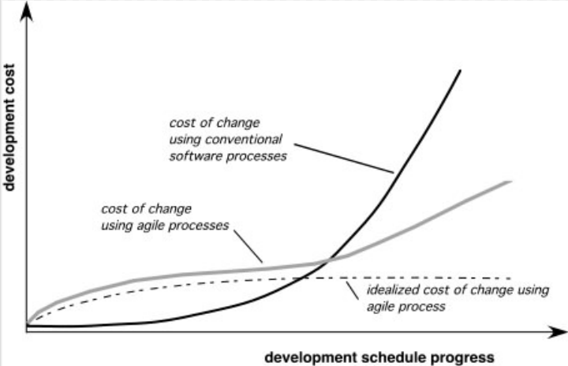

## An agile process
1. Is driven by customer descriptions of what is required (scenarios)
2. Recognizes that plans are short-lived
3. Develops software iteratively with a heavy emphasis on construction activities
4. Delivers multiple ‘software increments’
5. Adapts as changes occur

## Agile Frameworks
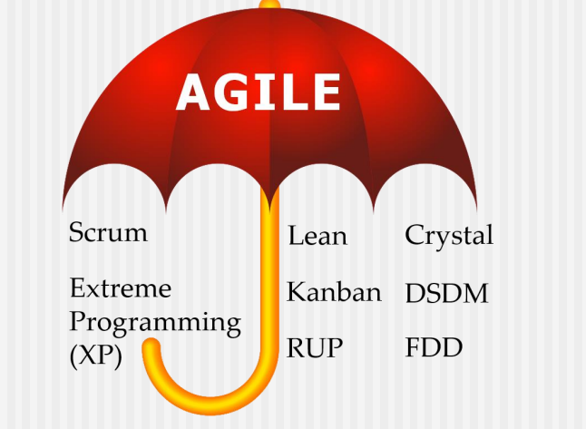
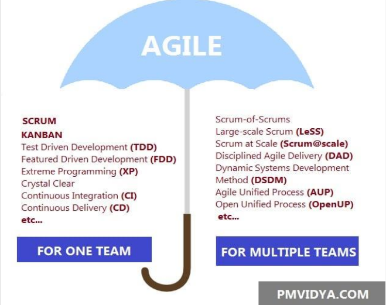

## Scrum
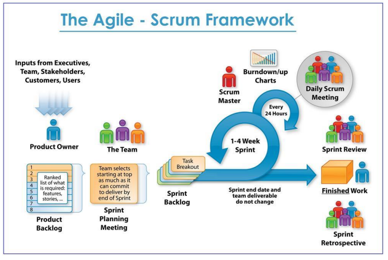
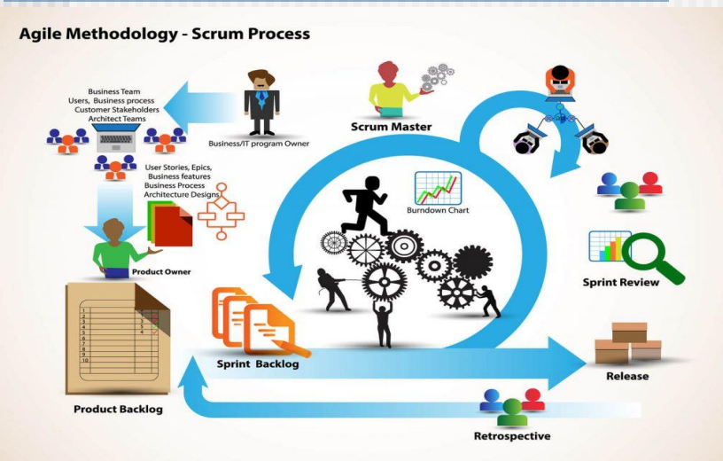

## Extreme Programming(XP)
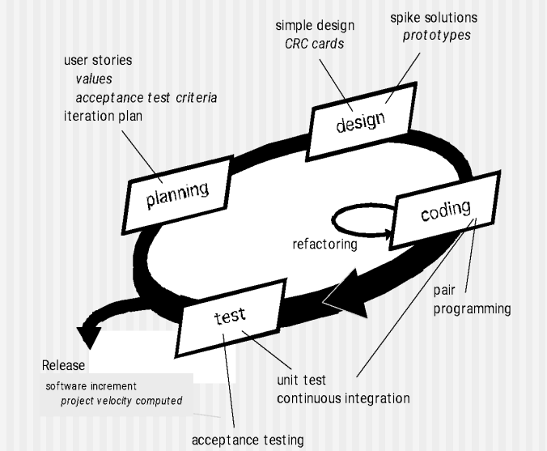

The most widely used agile process, originally proposed by Kent Beck

### XP Planning
■ Begins with the creation of “user stories”

■ Agile team assesses each story and assigns a cost

■ Stories are grouped to for a deliverable increment

■ A commitment is made on delivery date

■ After the first increment “project velocity” is used to help define subsequent delivery dates for other increments

###  XP Design
■ Follows the KISS principle

■ Encourage the use of CRC cards 

■ For difficult design problems, suggests the creation of “spike solutions”—a design prototype

■ Encourages “refactoring”—an iterative refinement of the 
internal program design

### XP Coding
■ Recommends the construction of a unit test for a store before coding commences

■ Encourages “pair programming”

### XP Testing
■ All unit tests are executed daily

■ “Acceptance tests” are defined by the customer and excuted to assess customer visible functionality
