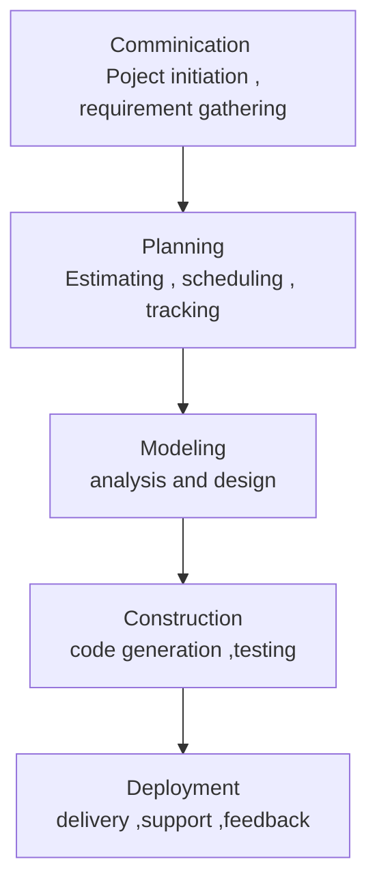

# Process Models

## Persepective Models

- Prescriptive process models advocate an orderly approach to software engineering

That leads to a few questions …
- If prescriptive process models strive for structure and order, are they inappropriate for a software world that thrives on change? 
- Yet, if we reject traditional process models (and the order they imply) and replace them with something less structured, do we make it impossible to achieve coordination and coherence in software work?

## The Waterfall Model

### Advantages
- Requirements are very well documented, clear and fixed.

- Technology is understood and is not dynamic.

- There are no ambiguous requirements.

- The project is short

### Disadvantages
- it does not allow for much reflection or revision

- Once an application is in the testing stage, it is very difficult to go back and change something that was not well-thought out in the concept stage.

- No working software is produced until late during the life cycle.

- High amounts of risk and uncertainty.

- Poor model for complex and object-oriented projects.

- Poor model for long and ongoing projects.

- Poor model where requirements are at a moderate to high risk of changing.

